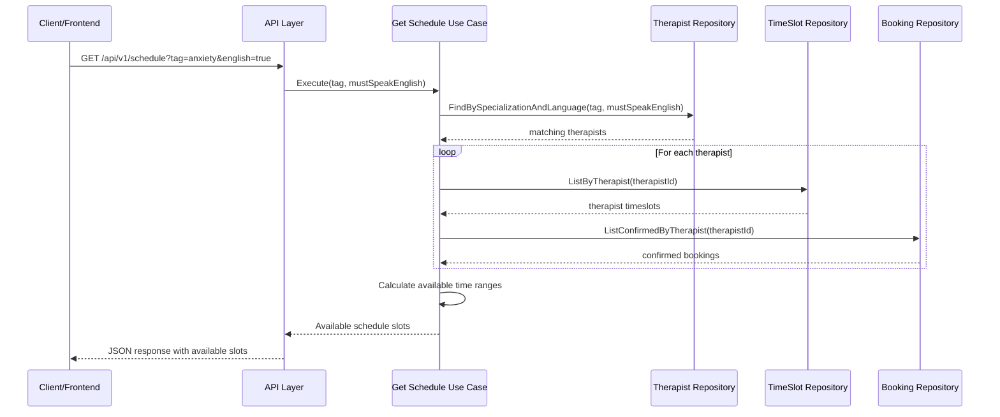

# "Get Schedule" Feature Implementation Plan

## 1. Feature Overview

The "Get Schedule" feature will allow users to search for available therapist time slots based on:
1. A tag (specialization) to match therapists
2. Whether the therapist must speak English
3. (Optional) Date range for availability

The feature will return timeslots with therapists who match the given criteria, accounting for existing bookings and buffer times to provide accurate availability.



## 2. Domain Model Enhancement

We need to create a new domain model to represent the available time ranges, with each time range containing a list of available therapists:

```go
// core/domain/schedule.go

package domain

import "time"

type TherapistInfo struct {
    ID             TherapistID      `json:"id"`
    Name           string           `json:"name"`
    Specializations []Specialization `json:"specializations"`
    SpeaksEnglish  bool             `json:"speaksEnglish"`
}

type AvailableTimeRange struct {
    Date           time.Time        `json:"date"`          // The specific date for this availability
    StartTime      time.Time        `json:"startTime"`     // Start of available range
    EndTime        time.Time        `json:"endTime"`       // End of available range
    DurationMinutes int             `json:"durationMinutes"` // Duration in minutes
    Therapists     []TherapistInfo  `json:"therapists"`    // List of therapists available in this time range
}

type ScheduleResponse struct {
    Availabilities []AvailableTimeRange `json:"availabilities"`
}
```

## 3. Repository Enhancements

### 3.1 Therapist Repository

We need to add a method to filter therapists by specialization and language capability:

```go
// core/ports/therapist_port.go

type TherapistRepository interface {
    // Existing methods...
    
    // New method
    FindBySpecializationAndLanguage(specializationName string, mustSpeakEnglish bool) ([]*domain.Therapist, error)
}
```

Implementation in `adapters/db/therapist/therapist_repo.go`:

```go
func (r *TherapistRepository) FindBySpecializationAndLanguage(specializationName string, mustSpeakEnglish bool) ([]*domain.Therapist, error) {
    query := `
        SELECT DISTINCT t.id, t.name, t.email, t.phone_number, t.whatsapp_number, t.speaks_english, t.created_at, t.updated_at
        FROM therapists t
        JOIN therapist_specializations ts ON t.id = ts.therapist_id
        JOIN specializations s ON ts.specialization_id = s.id
        WHERE s.name = ?
    `
    
    args := []interface{}{specializationName}
    
    if mustSpeakEnglish {
        query += " AND t.speaks_english = TRUE"
    }
    
    query += " ORDER BY t.name ASC"
    
    // Execute query and scan results...
    // Load specializations for each therapist...
    
    return therapists, nil
}
```

### 3.2 TimeSlot Repository Implementation

We need to implement the TimeSlot repository as it doesn't exist yet:

```go
// adapters/db/timeslot/timeslot_repo.go

package timeslot

// Implementation of TimeSlotRepository with methods:
// - GetByID
// - Create
// - Update
// - Delete
// - ListByTherapist
// - ListByDay
```

### 3.3 Booking Repository Enhancement

We need to add a method to get confirmed bookings for a specific date range:

```go
// core/ports/booking_port.go

type BookingRepository interface {
    // Existing methods...
    
    // New method
    ListConfirmedByTherapistForDateRange(therapistID domain.TherapistID, startDate, endDate time.Time) ([]*domain.Booking, error)
}
```

## 4. Use Case Implementation

Create a new use case for retrieving the schedule:

```go
// core/usecases/schedule/get_schedule/get_schedule_usecase.go

package get_schedule

import (
    "errors"
    "time"
    
    "github.com/mishkahtherapy/brain/core/domain"
    "github.com/mishkahtherapy/brain/core/ports"
)

type Input struct {
    SpecializationTag string
    MustSpeakEnglish  bool
    StartDate         time.Time
    EndDate           time.Time
}

type Usecase struct {
    therapistRepo ports.TherapistRepository
    timeSlotRepo  ports.TimeSlotRepository
    bookingRepo   ports.BookingRepository
}

// NewUsecase creates a new get schedule usecase
// Execute method to implement the main logic:
// 1. Find therapists matching criteria
// 2. For each therapist, get timeslots and bookings
// 3. Calculate available time ranges
// 4. Return the schedule response
```

### 4.1 Interval Partitioning Algorithm for Time Ranges

To efficiently handle overlapping time ranges from multiple therapists, we'll use a Line Sweep Algorithm (also known as the Interval Partitioning Algorithm):

```go
// calculateAvailableTimeRanges calculates available time ranges using a line sweep algorithm
func (u *Usecase) calculateAvailableTimeRanges(
    therapists []*domain.Therapist,
    therapistTimeSlots map[domain.TherapistID][]*domain.TimeSlot,
    therapistBookings map[domain.TherapistID][]*domain.Booking,
    startDate, endDate time.Time,
) []domain.AvailableTimeRange {
    // Step 1: Collect all therapist availabilities as individual time ranges
    type TherapistAvailability struct {
        TherapistID domain.TherapistID
        Therapist   *domain.Therapist
        StartTime   time.Time
        EndTime     time.Time
    }
    
    allAvailabilities := []TherapistAvailability{}
    
    // For each therapist, calculate their available time ranges
    for _, therapist := range therapists {
        therapistID := therapist.ID
        timeSlots := therapistTimeSlots[therapistID]
        bookings := therapistBookings[therapistID]
        
        // Convert bookings to a map for efficient lookup
        bookingMap := makeBookingMap(bookings)
        
        // For each day in the date range
        for current := startDate; !current.After(endDate); current = current.AddDate(0, 0, 1) {
            dayOfWeek := domain.DayOfWeek(current.Weekday().String())
            
            // For each time slot on this day
            for _, slot := range timeSlots {
                if slot.DayOfWeek != dayOfWeek {
                    continue
                }
                
                // Calculate the specific time slot for this date
                slotStart, slotEnd := getSlotTimes(current, slot)
                
                // If the slot is in the past, skip it
                if slotEnd.Before(time.Now()) {
                    continue
                }
                
                // Get bookings for this slot on this day
                dayBookings := getBookingsForSlot(bookingMap, slot.ID, current)
                
                // If no bookings, add the entire slot as available
                if len(dayBookings) == 0 {
                    allAvailabilities = append(allAvailabilities, TherapistAvailability{
                        TherapistID: therapistID,
                        Therapist:   therapist,
                        StartTime:   slotStart,
                        EndTime:     slotEnd,
                    })
                    continue
                }
                
                // Calculate available ranges between bookings
                availableRanges := calculateAvailableRangesBetweenBookings(
                    slotStart, slotEnd, dayBookings, slot.PreSessionBuffer, slot.PostSessionBuffer)
                
                // Add each available range
                for _, r := range availableRanges {
                    allAvailabilities = append(allAvailabilities, TherapistAvailability{
                        TherapistID: therapistID,
                        Therapist:   therapist,
                        StartTime:   r.StartTime,
                        EndTime:     r.EndTime,
                    })
                }
            }
        }
    }
    
    // Step 2: Apply the line sweep algorithm to merge overlapping ranges
    return applyLineSweepAlgorithm(allAvailabilities)
}

// applyLineSweepAlgorithm implements the line sweep algorithm to find all unique time ranges
// and the therapists available during each range
func applyLineSweepAlgorithm(availabilities []TherapistAvailability) []domain.AvailableTimeRange {
    if len(availabilities) == 0 {
        return []domain.AvailableTimeRange{}
    }
    
    // Step 1: Collect all time points (start and end times)
    type TimePoint struct {
        Time       time.Time
        IsStart    bool
        TherapistID domain.TherapistID
        Therapist  *domain.Therapist
    }
    
    timePoints := []TimePoint{}
    
    for _, avail := range availabilities {
        timePoints = append(timePoints, TimePoint{
            Time:       avail.StartTime,
            IsStart:    true,
            TherapistID: avail.TherapistID,
            Therapist:  avail.Therapist,
        })
        
        timePoints = append(timePoints, TimePoint{
            Time:       avail.EndTime,
            IsStart:    false,
            TherapistID: avail.TherapistID,
            Therapist:  avail.Therapist,
        })
    }
    
    // Step 2: Sort time points
    sort.Slice(timePoints, func(i, j int) bool {
        if timePoints[i].Time.Equal(timePoints[j].Time) {
            // If times are equal, prioritize end points before start points
            return !timePoints[i].IsStart && timePoints[j].IsStart
        }
        return timePoints[i].Time.Before(timePoints[j].Time)
    })
    
    // Step 3: Sweep through time points
    result := []domain.AvailableTimeRange{}
    activeTherapists := map[domain.TherapistID]*domain.Therapist{}
    var lastTime time.Time
    
    for i, point := range timePoints {
        // Skip the first point (we need pairs)
        if i == 0 {
            if point.IsStart {
                activeTherapists[point.TherapistID] = point.Therapist
            }
            lastTime = point.Time
            continue
        }
        
        // If there are active therapists and time has advanced, create a range
        if len(activeTherapists) > 0 && !lastTime.Equal(point.Time) {
            // Convert active therapists to TherapistInfo
            therapistInfos := []domain.TherapistInfo{}
            for _, t := range activeTherapists {
                therapistInfos = append(therapistInfos, domain.TherapistInfo{
                    ID:             t.ID,
                    Name:           t.Name,
                    Specializations: t.Specializations,
                    SpeaksEnglish:  t.SpeaksEnglish,
                })
            }
            
            // Only add ranges with at least 30 minutes duration
            duration := int(point.Time.Sub(lastTime).Minutes())
            if duration >= 30 {
                // Determine the date (just the date part of the time)
                date := time.Date(lastTime.Year(), lastTime.Month(), lastTime.Day(), 0, 0, 0, 0, lastTime.Location())
                
                result = append(result, domain.AvailableTimeRange{
                    Date:           date,
                    StartTime:      lastTime,
                    EndTime:        point.Time,
                    DurationMinutes: duration,
                    Therapists:     therapistInfos,
                })
            }
        }
        
        // Update active therapists
        if point.IsStart {
            activeTherapists[point.TherapistID] = point.Therapist
        } else {
            delete(activeTherapists, point.TherapistID)
        }
        
        lastTime = point.Time
    }
    
    return result
}
```

This line sweep algorithm efficiently handles overlapping time ranges:

1. It collects all start and end points from all therapist availabilities
2. It sorts these points chronologically
3. It sweeps through the points, keeping track of which therapists are active at each moment
4. When the set of active therapists changes (due to a start or end point), it creates a new time range with the current set of active therapists

The result will be a series of non-overlapping time ranges, each with a list of therapists available during that specific range. This addresses the example provided:

- 7-9 AM: Therapist A
- 9-10 AM: Therapist A, Therapist B
- 10-11 AM: Therapist A

## 5. API Handler Implementation

```go
// adapters/api/schedule_handler.go

package api

import (
    "net/http"
    "time"
    
    "github.com/mishkahtherapy/brain/core/usecases/schedule/get_schedule"
)

type ScheduleHandler struct {
    getScheduleUsecase get_schedule.Usecase
}

// Implementation of HTTP handler for the schedule endpoint
// - Parse query parameters (tag, english, start_date, end_date)
// - Execute use case
// - Return JSON response
```

## 6. Integration in Main

Update `main.go` to wire up the new components:

```go
// In main.go

// Initialize repositories
timeSlotRepo := timeslot.NewTimeSlotRepository(database)

// Initialize use cases
getScheduleUsecase := get_schedule.NewUsecase(therapistRepo, timeSlotRepo, bookingRepo)

// Initialize handlers
scheduleHandler := api.NewScheduleHandler(*getScheduleUsecase)

// Register routes
scheduleHandler.RegisterRoutes(mux)
```

## 7. Testing Strategy

### 7.1 Unit Tests

- Test the line sweep algorithm with various combinations of overlapping time ranges
- Test the filtering of therapists by specialization and language
- Test the handling of date ranges and edge cases

### 7.2 Integration Tests

- Test the complete flow from API request to response
- Test with real data from the database
- Test edge cases like no matching therapists, no available slots, etc.

## 8. API Endpoint

```
GET /api/v1/schedule
```

Query Parameters:
- `tag` (required): Specialization tag to filter therapists
- `english` (optional): Set to "true" to require English-speaking therapists
- `start_date` (optional): Start date for availability in YYYY-MM-DD format (defaults to today)
- `end_date` (optional): End date for availability in YYYY-MM-DD format (defaults to 2 weeks from start)

Example:
```
GET /api/v1/schedule?tag=anxiety&english=true&start_date=2025-07-01&end_date=2025-07-15
```

## 9. Sample API Response

```json
{
  "availabilities": [
    {
      "date": "2025-07-01T00:00:00Z",
      "startTime": "2025-07-01T07:00:00Z",
      "endTime": "2025-07-01T09:00:00Z",
      "durationMinutes": 120,
      "therapists": [
        {
          "id": "therapist_abc123",
          "name": "Dr. Smith",
          "specializations": [
            {
              "id": "specialization_xyz789",
              "name": "anxiety",
              "createdAt": "2024-01-15T12:00:00Z",
              "updatedAt": "2024-01-15T12:00:00Z"
            }
          ],
          "speaksEnglish": true
        }
      ]
    },
    {
      "date": "2025-07-01T00:00:00Z",
      "startTime": "2025-07-01T09:00:00Z",
      "endTime": "2025-07-01T10:00:00Z",
      "durationMinutes": 60,
      "therapists": [
        {
          "id": "therapist_abc123",
          "name": "Dr. Smith",
          "specializations": [
            {
              "id": "specialization_xyz789",
              "name": "anxiety",
              "createdAt": "2024-01-15T12:00:00Z",
              "updatedAt": "2024-01-15T12:00:00Z"
            }
          ],
          "speaksEnglish": true
        },
        {
          "id": "therapist_def456",
          "name": "Dr. Johnson",
          "specializations": [
            {
              "id": "specialization_xyz789",
              "name": "anxiety",
              "createdAt": "2024-01-15T12:00:00Z",
              "updatedAt": "2024-01-15T12:00:00Z"
            }
          ],
          "speaksEnglish": true
        }
      ]
    },
    {
      "date": "2025-07-01T00:00:00Z",
      "startTime": "2025-07-01T10:00:00Z",
      "endTime": "2025-07-01T11:00:00Z",
      "durationMinutes": 60,
      "therapists": [
        {
          "id": "therapist_abc123",
          "name": "Dr. Smith",
          "specializations": [
            {
              "id": "specialization_xyz789",
              "name": "anxiety",
              "createdAt": "2024-01-15T12:00:00Z",
              "updatedAt": "2024-01-15T12:00:00Z"
            }
          ],
          "speaksEnglish": true
        }
      ]
    }
  ]
}
```

## 10. Implementation Steps

1. Create the domain models for the schedule response
2. Implement the TimeSlot repository
3. Add the FindBySpecializationAndLanguage method to the Therapist repository
4. Add the ListConfirmedByTherapistForDateRange method to the Booking repository
5. Implement the GetSchedule use case with the line sweep algorithm
6. Create the API handler and routes
7. Update main.go to wire everything together
8. Write tests
9. Document the API

## 11. Complexity Analysis

The line sweep algorithm has the following complexity:
- Time Complexity: O(n log n) where n is the number of time points (start/end times from all therapists)
- Space Complexity: O(n) to store the time points and result

This is efficient even with many therapists and time slots, as the sorting operation dominates the complexity.