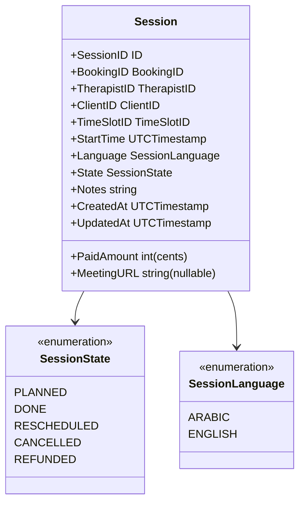
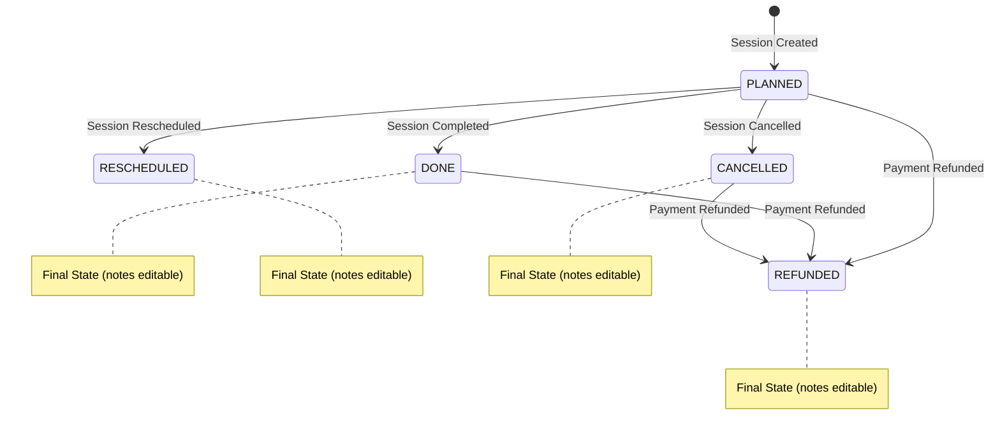
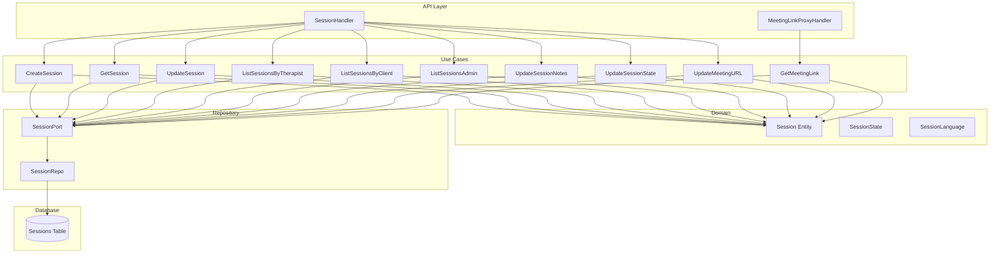

# Session Feature Implementation Plan

## Overview
The Session feature will create session instances when bookings are confirmed (paid). Sessions track the actual therapy appointment execution, payment, notes, and meeting logistics.

## 1. Domain Model Design

### Session Entity


### State Transition Rules


## 2. Database Schema

### Sessions Table
```sql
CREATE TABLE sessions (
    id VARCHAR(128) PRIMARY KEY,
    booking_id VARCHAR(128) NOT NULL UNIQUE,
    therapist_id VARCHAR(128) NOT NULL,
    client_id VARCHAR(128) NOT NULL,
    timeslot_id VARCHAR(128) NOT NULL,
    start_time DATETIME NOT NULL,
    paid_amount INTEGER NOT NULL, -- USD cents
    language VARCHAR(10) NOT NULL CHECK (language IN ('arabic', 'english')),
    state VARCHAR(20) NOT NULL DEFAULT 'planned' CHECK (state IN ('planned', 'done', 'rescheduled', 'cancelled', 'refunded')),
    notes TEXT,
    meeting_url VARCHAR(512), -- nullable, added manually
    created_at DATETIME DEFAULT CURRENT_TIMESTAMP,
    updated_at DATETIME DEFAULT CURRENT_TIMESTAMP,
    
    CONSTRAINT fk_sessions_booking FOREIGN KEY (booking_id) REFERENCES bookings(id) ON DELETE CASCADE,
    CONSTRAINT fk_sessions_therapist FOREIGN KEY (therapist_id) REFERENCES therapists(id) ON DELETE CASCADE,
    CONSTRAINT fk_sessions_client FOREIGN KEY (client_id) REFERENCES clients(id) ON DELETE CASCADE,
    CONSTRAINT fk_sessions_timeslot FOREIGN KEY (timeslot_id) REFERENCES time_slots(id) ON DELETE CASCADE
);

-- Indexes
CREATE INDEX idx_sessions_booking ON sessions(booking_id);
CREATE INDEX idx_sessions_therapist ON sessions(therapist_id);
CREATE INDEX idx_sessions_client ON sessions(client_id);
CREATE INDEX idx_sessions_state ON sessions(state);
CREATE INDEX idx_sessions_start_time ON sessions(start_time);
CREATE INDEX idx_sessions_therapist_start_time ON sessions(therapist_id, start_time);
```

## 3. Core Components Architecture



## 4. Implementation Components

### 4.1 Domain Layer
- **Files to create:**
  - `core/domain/session.go` - Session entity, states, language enum
- **Files to modify:**
  - `core/domain/id.go` - Add SessionID type and generator

### 4.2 Port Layer  
- **Files to create:**
  - `core/ports/session_port.go` - SessionRepository interface

### 4.3 Use Cases
- **Files to create:**
  - `core/usecases/session/create_session/create_session_usecase.go`
  - `core/usecases/session/get_session/get_session_usecase.go`
  - `core/usecases/session/update_session_state/update_session_state_usecase.go`
  - `core/usecases/session/update_session_notes/update_session_notes_usecase.go`
  - `core/usecases/session/update_meeting_url/update_meeting_url_usecase.go`
  - `core/usecases/session/list_sessions_by_therapist/list_sessions_by_therapist_usecase.go`
  - `core/usecases/session/list_sessions_by_client/list_sessions_by_client_usecase.go`
  - `core/usecases/session/list_sessions_admin/list_sessions_admin_usecase.go`
  - `core/usecases/session/get_meeting_link/get_meeting_link_usecase.go`

### 4.4 Repository Layer
- **Files to create:**
  - `adapters/db/session/session_repo.go` - Session repository implementation

### 4.5 API Layer
- **Files to create:**
  - `adapters/api/session_handler.go` - Session HTTP handlers
  - `adapters/api/meeting_link_proxy_handler.go` - Meeting link proxy handler

### 4.6 Integration Points
- **Files to modify:**
  - `core/usecases/booking/confirm_booking/confirm_booking_usecase.go` - Add session creation with paid amount and language
  - `schema.sql` - Add sessions table
  - `main.go` - Wire up session components

## 5. API Endpoints

### Session Management
- `POST /api/v1/sessions` - Create session (manual creation)
- `GET /api/v1/sessions/{id}` - Get session details
- `PUT /api/v1/sessions/{id}/state` - Update session state  
- `PUT /api/v1/sessions/{id}/notes` - Update session notes
- `PUT /api/v1/sessions/{id}/meeting-url` - Update meeting URL
- `GET /api/v1/therapists/{id}/sessions` - List therapist sessions
- `GET /api/v1/clients/{id}/sessions` - List client sessions

### Admin Endpoints
- `GET /api/v1/admin/sessions` - List all sessions with time range filter

### Meeting Link Proxy
- `GET /api/v1/sessions/{id}/meeting` - Redirect to meeting URL

## 6. Business Rules Implementation

### Session Creation Rules
1. Session created automatically when booking confirmed with paid amount and language
2. Initial state: `PLANNED`
3. Meeting URL initially null, added manually
4. Paid amount and language provided during creation

### Update Rules  
1. **Final states** (`done`, `rescheduled`, `cancelled`, `refunded`) - only notes and meeting URL editable
2. **Planned state** - all fields editable except booking-related data
3. **State transitions** - validate according to state diagram
4. **Notes** - always appendable with timestamp
5. **Meeting URL** - editable at any time

### Security & Access
1. Therapists can access their own sessions
2. Clients can access their own sessions  
3. Admin role can access all sessions with time range filtering
4. Meeting link proxy requires valid session ID and non-null meeting URL

## 7. Modified Booking Confirmation

### Updated Confirm Booking Input
```go
type Input struct {
    BookingID domain.BookingID `json:"bookingId"`
    PaidAmount int `json:"paidAmount"` // USD cents
    Language domain.SessionLanguage `json:"language"`
}
```

### Session Creation Flow
1. Booking confirmed with payment details
2. Session automatically created with:
   - All booking information copied
   - Paid amount from confirmation
   - Language from confirmation
   - State: PLANNED
   - Meeting URL: null

## 8. Testing Strategy

### Unit Tests
- Domain entity validation
- Use case business logic
- Repository operations
- State transition validation
- Meeting link proxy logic

### Integration Tests  
- Session creation flow from booking confirmation
- API endpoint behavior
- Database constraints
- Meeting link proxy functionality
- Admin time range filtering

### E2E Tests
- Complete booking → session → meeting flow
- Session state lifecycle
- Notes management workflow
- Admin session management

---

## Implementation Order

1. **Domain Layer** - Session entity, states, language enum
2. **Database Schema** - Add sessions table to schema.sql
3. **Repository Layer** - Session repository with full CRUD operations
4. **Use Cases** - All session-related use cases
5. **API Layer** - Session handlers and meeting link proxy
6. **Integration** - Update booking confirmation to create sessions
7. **Testing** - Comprehensive test coverage
8. **Documentation** - API documentation and usage examples

This plan provides a complete Session feature that integrates seamlessly with your existing booking system while maintaining the clean architecture pattern you've established.